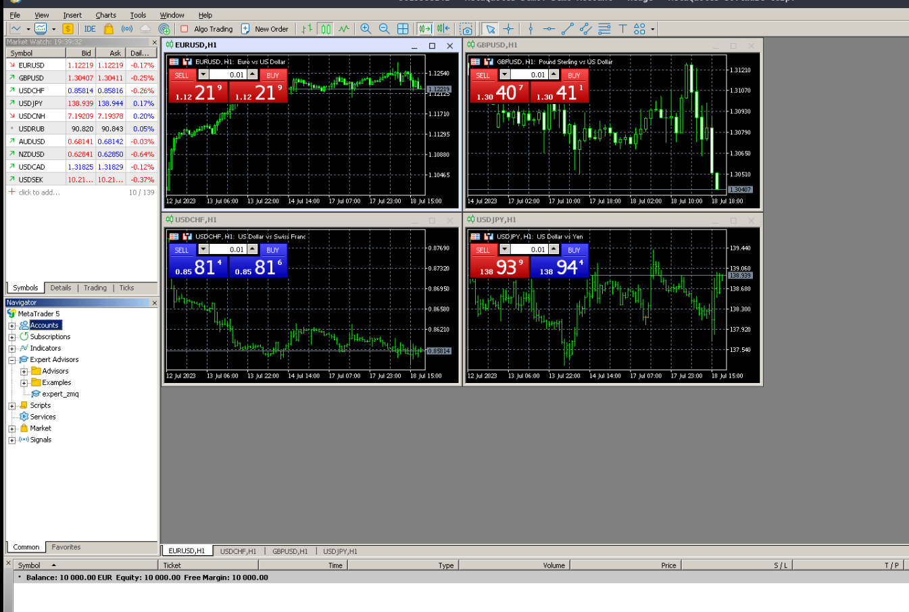
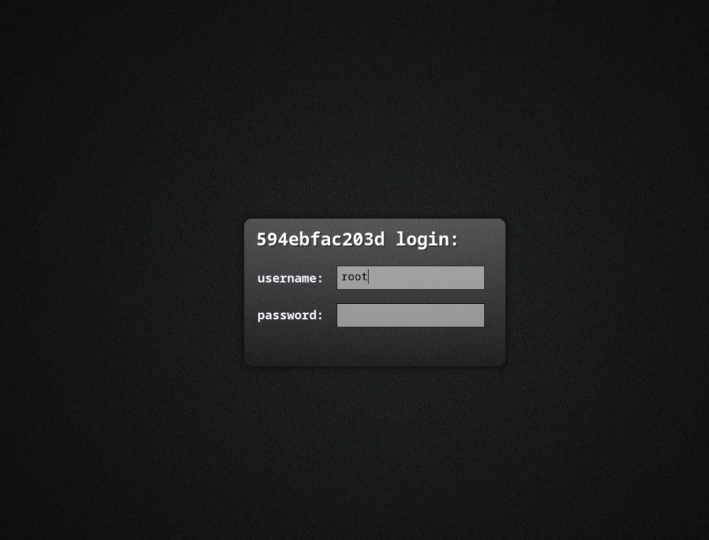
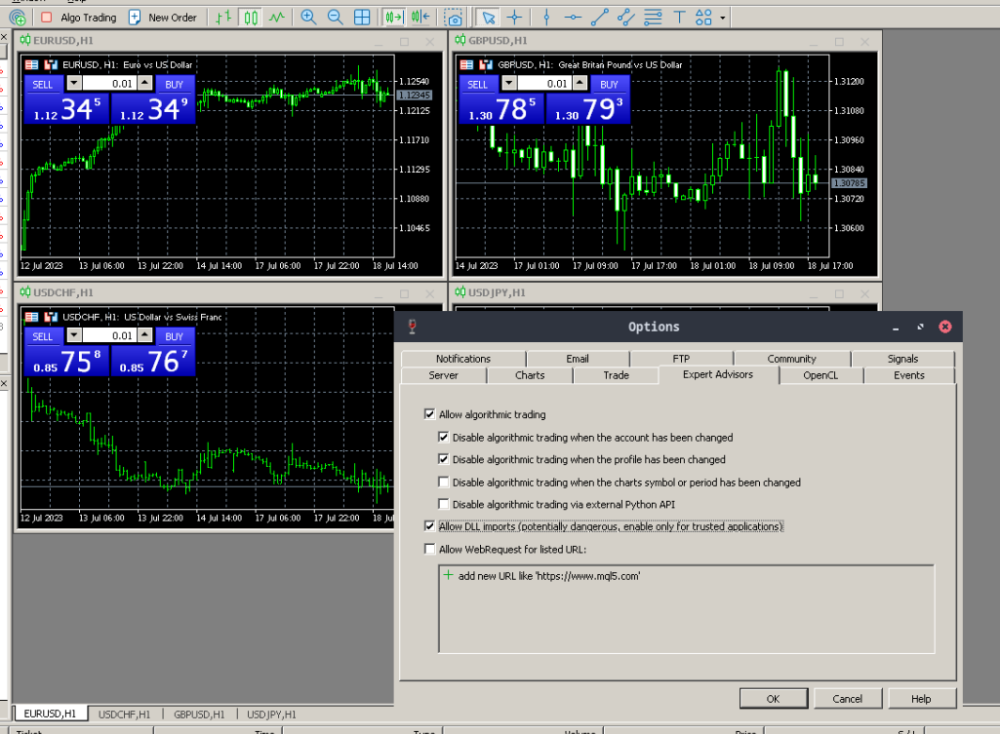
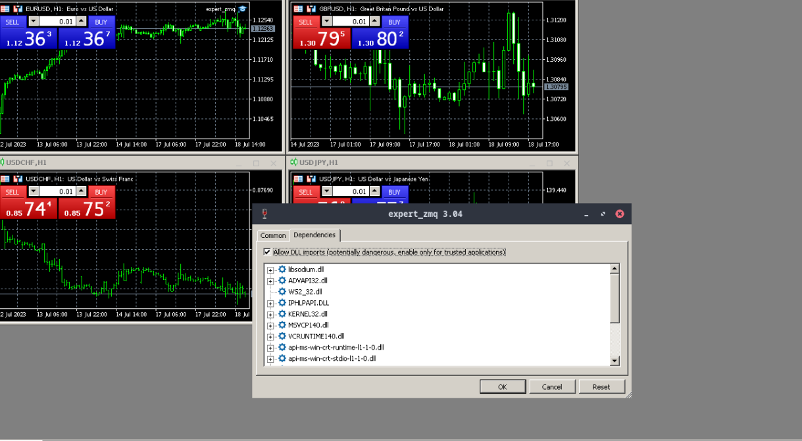

# Docker MT5, VNC, ZMQ, UBUNTU

This project contains everything needed to run an instance of MetaTrader 5 in a Docker container and access it via VNC.
Instructions:

1. Download MetaTrader 5: You can get the latest version of MetaTrader 5 from the official website.
2. Prepare the necessary files:
   - Open MetaTrader 5:
     - Start the MetaTrader 5 application on your computer.
   
   - Access the data folder:
     - Once in the application, go to the top left of the screen and click on the File dropdown menu. Here you will find an option called Open Data Folder. Click on this option.
   - Copy the MQL5 folder:
     - A file explorer window will open showing you the location of the MetaTrader 5 data. Within this folder, you will find a subfolder called MQL5.
     - Right-click on the MQL5 folder and select Copy.
   - Paste the MQL5 folder into the correct location:
     - Now, you need to go to the MetaTrader 5 installation location. Usually, this will be in the Program Files folder on your computer.
     - To get there, open a new file explorer window, go to This PC, then to your hard drive (usually C:), and finally to Program Files. Here you will find the MetaTrader 5 folder.
     - Open the MetaTrader 5 folder, right-click in the empty space, and select Paste. This will copy the MQL5 folder you copied earlier to the MetaTrader 5 folder in Program Files.
   - Clone the project:
     - To start, you need a local copy of the repository. On GitHub, go to the main page of the repository and click on the Code button. In the dropdown menu, click Clone to copy the repository link.
     - Open a terminal on your computer. Navigate to the directory where you want to clone the repository using the cd [path/to/directory] command.
     - Type the command git clone https://github.com/SmartLever/Docker_mt5.git to clone the repository on your computer.
   - Navigate to the project folders:
     - Once the repository has been cloned, navigate to it using the terminal. This will take you to the main page of your local repository.
   - Locate the required folders:
     - Within the local repository, you will find several folders. Look for a folder called MT5Resources.
   - Copy the necessary folders:
     - Click on the MT5Resources folder. Inside it, you will find the libraries, expert, and scripts folders.
     - Right-click on each of these folders and select Copy.
   - Paste the copied folders into the MQL5 folder of your local MetaTrader 5 installation:
     - Go back to the Program Files folder on your computer where the MetaTrader 5 installation is located.
     - Navigate to the MQL5 folder within the MetaTrader 5 folder.
     - Right-click in an empty space inside the MQL5 folder and select Paste. This will paste the libraries, expert, and scripts folders that you copied earlier into the MQL5 folder.
   - Copy all content from the local MetaTrader 5 installation to the Metatrader folder of your project:
     - Go back to the MetaTrader 5 folder in Program Files, where the full MetaTrader 5 installation is located.
     - Select all folders and files, right-click, and select Copy.
     - Return to the main page of your local repository and click on the Metatrader folder.
     - Right-click in an empty space inside the Metatrader folder and select Paste. This will copy all the content from the MetaTrader 5 installation to your project.
3. Execution:
   - Run the ./docker_executable script: Once done, MetaTrader 5 will be running correctly.
4. VNC:
   -  Access the graphical interface of MT5 through VNC, download the VNC client based on your operating system.
   -  Once inside, you will need to enter a username and password, which can be changed in the Dockerfile, in our case it's root and root.
   
5. MetaTrader 5 in Docker:
   - Log into MetaTrader 5:
     - In your VNC client, start MetaTrader 5. A login window will appear.
     - Enter your MetaTrader 5 username and password. After entering your details, click the Login button to access the platform.
   - Enable algorithmic trading and DLL imports:
     - Once you have logged in, go to the top menu and click on Tools.
     - In the dropdown menu, select Options. A new window with various tabs will appear.
     - Click on the Expert Advisors tab.
     - Within this tab, you will see several options. Be sure to check the box Allow Algorithmic Trading and Allow DLL Imports.
     - Click OK to save your changes.
   
   - Attach the expert to the chart:
     To use ZeroMQ in MetaTrader we must use the expert with the name expert_zmq, for that
     - Go to the Navigator panel on the left side of the MetaTrader 5 platform.
     - Here, you will find a section called Expert Advisors. Click on it to expand the section.
     - Look for the name of your expert (expert_zmq). When you find it, click and hold, then drag it onto the chart where you want to apply it.
   - Configure the expert:
     - When you release the expert onto the chart, a configuration window will appear.
     - Here, you can adjust the expert parameters according to your needs.
     - Once you have finished configuring the expert, click OK.
   

Now, you should have successfully set up MetaTrader 5 within a Docker container, ready to be accessed via VNC, and with ZeroMQ enabled!
     
     
## Other Info

### Subscribe to our news!
    https://smartlever.substack.com/

### Bugs
Please report any bugs or issues on the GitHub's Issues page.

### Contributing and Contact
If you would like to support the project, pull requests are welcome. You can contact us at andres@smartlever.tech

### Licensing 
**SmartBots** is distributed under the [**GNU GENERAL PUBLIC LICENSE**]. See the [LICENSE](/LICENSE) for more details.
